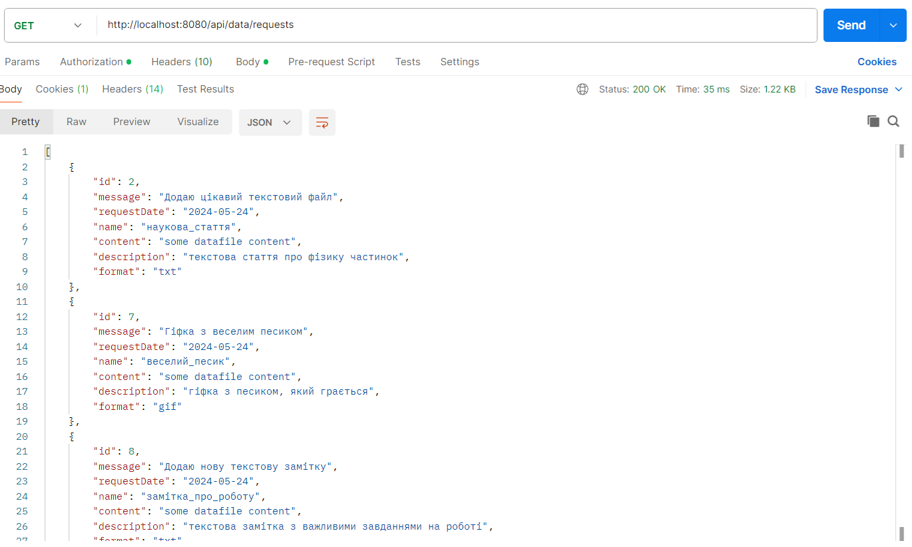
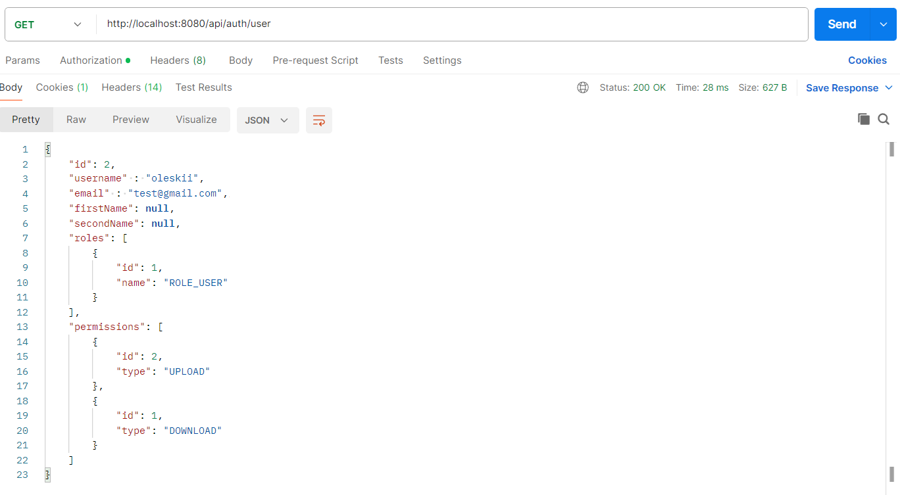
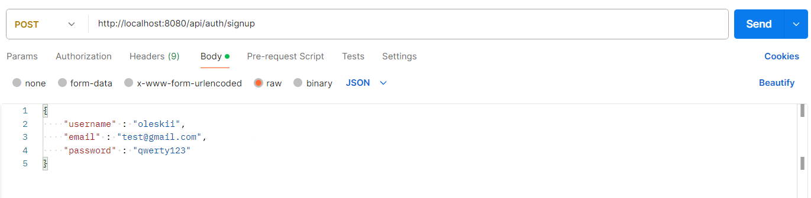
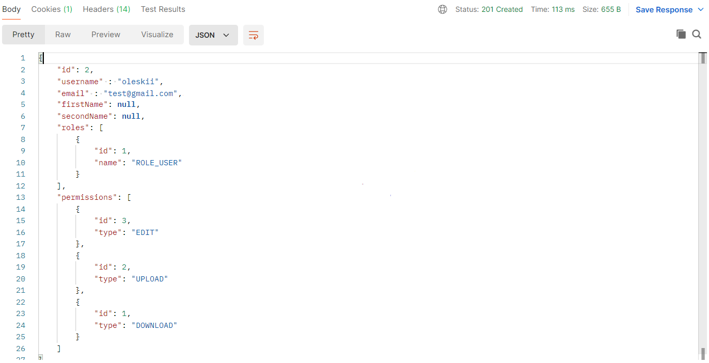
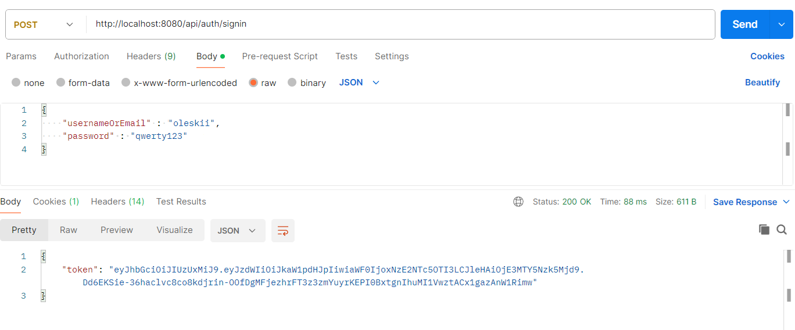
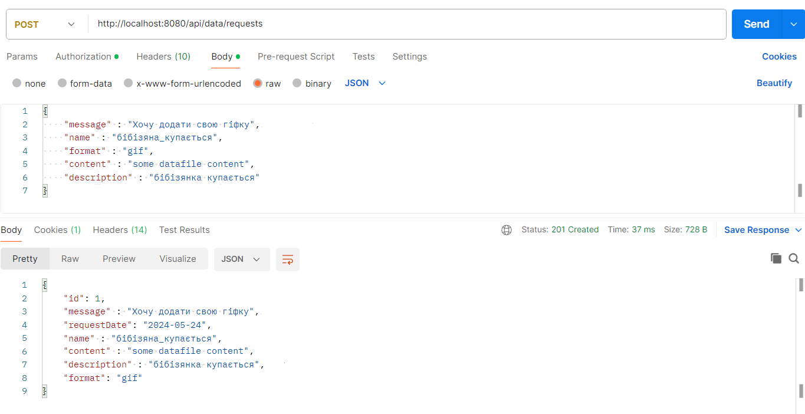
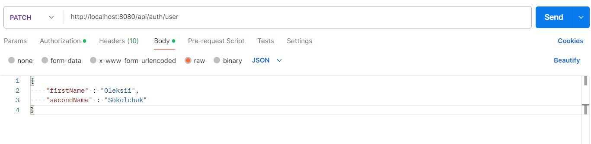
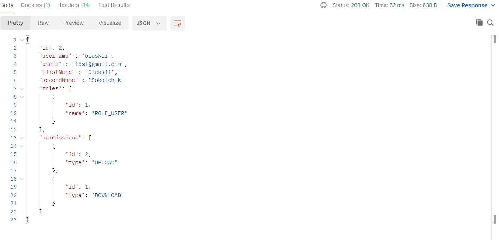

# Тестування працездатності системи

*В цьому розділі необхідно вказати засоби тестування, навести вихідні коди тестів та результати тестування.*
*Тестування виконується за допомогою Postman*
*Для авторизації використовуються JWT токени. У кожному запиті Користувача або Адміністратора в Headers додається Authorization з токеном*

## GET

### Отримати всі запити (виводяться запити користувача) - Користувач

### Отримати дані користувача - Користувач

## POST

### Зареєстуватись - Гість

### Авторизуватись - Гість

### Відправити запит - Користувач

## PATCH

### Оновити профіль користувача - Користувач

